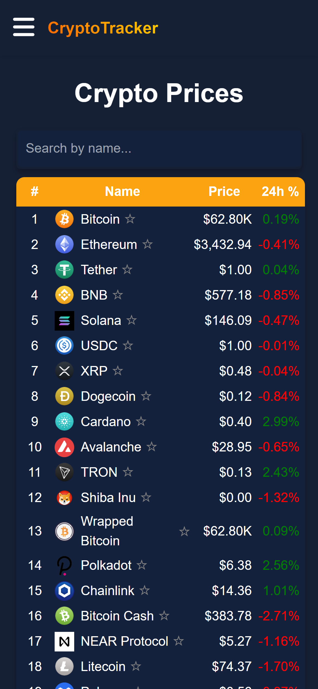
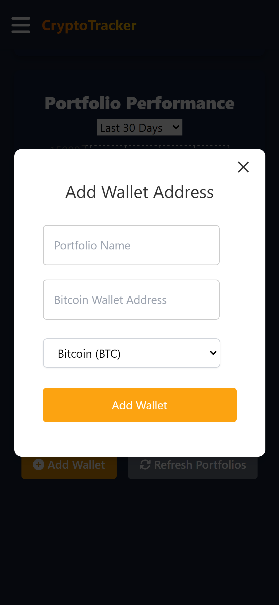

<picture>
  <source media="(prefers-color-scheme: light)" srcset="https://github.com/agiledev-students-spring2024/4-final-project-crypto-portfolio-tracker/assets/115737572/b94199e8-695a-4862-9eec-217fb2b11c7f">
  <source media="(prefers-color-scheme: dark)" srcset="https://github.com/agiledev-students-spring2024/4-final-project-crypto-portfolio-tracker/assets/115737572/d362a869-260a-48ea-bf13-9680ffe44e4f">
  
</picture>

## Product Vision Statement
The Crypto Portfolio Tracker and Analyzer aims to empower individual crypto investors by providing a comprehensive and intuitive platform to track and analyze the performance of their cryptocurrency investments. In the fast-paced and volatile crypto market, staying informed is key to making educated investment decisions. Our application addresses this need by offering real-time market data, insightful analysis, and user-friendly data visualization to cater to both novice and experienced traders.

## Core Team
- **Reyhan Abdul Quayum** - Developer  
  GitHub: [Reyhan's GitHub](https://github.com/ReyhanQ)  

- **Alessandro Landi** - Developer  
  GitHub: [Alessandro's GitHub](https://github.com/alessandrolandi)  

- **Ryan Rim** - Developer  
  GitHub: [Ryan's GitHub](https://github.com/rryan1010)  

## Gallery

  

## Project Genesis
The idea for the Crypto Portfolio Tracker and Analyzer was born out of the personal experiences of its creators, Alessandro, Reyhan, and Ryan who recognized the challenges of managing crypto investments through disparate platforms and tools. The project aims to consolidate various tools into a single, coherent application that provides real-time insights, trend analysis, and portfolio performance in an accessible manner for everyone invested in the cryptocurrency market.

## Contributing
We welcome contributions from the community! For more information on how to contribute, please refer to our [CONTRIBUTING.md](./CONTRIBUTING.md) document.

## Getting Started

To set up the project locally, ensure you have [Node.js](https://nodejs.org/) and [npm](https://www.npmjs.com/) installed. Clone the repository and install dependencies:

```bash
git clone https://github.com/YourProjectRepository
cd YourProjectRepository
npm install
```

To run the project:
```bash
cd front-end
npm start
```
Then,
```bash
cd back-end
npx nodemon server
```

